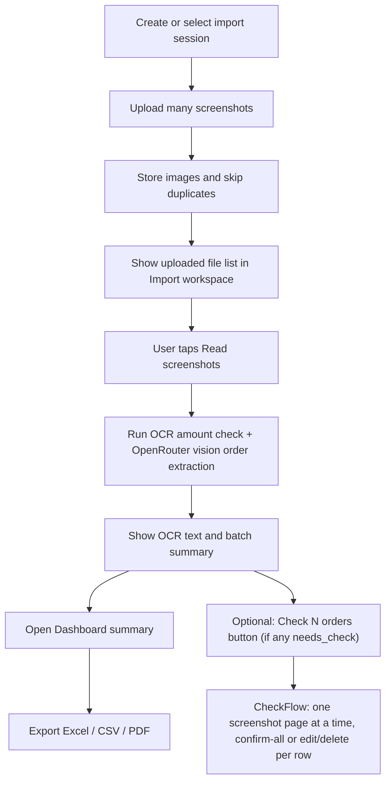

# OrderLedger Project Index

Fast map for AI agents and future handoff work.

For the staged import UX/state rationale, read `docs/IMPORT_WORKSPACE_AUDIT.md`.

## One-Sentence Product

OrderLedger reads monthly food delivery screenshots, extracts order rows, summarizes spending, and exports Excel / CSV / PDF.

## Current User Flow

Main point: upload should show the file list first; Read is the explicit extraction action. Check is optional and only reachable from the Import workspace, never a main tab.

## Main Files

### Frontend

- `src/main.tsx` - React entrypoint.
- `src/App.tsx` - app shell, tab selection, sheets, top-level flow.
- `src/api.ts` - all frontend HTTP calls and frontend-facing API types.
- `src/state/AppData.tsx` - shared app state, active batch, summary, settings, upload/process actions.
- `src/styles.css` - app-level CSS imports and small page-specific layout.
- `src/design/tokens.css` - current design tokens.
- `src/design/components.css` - current component styles.

### Screens

- `src/screens/HomeScreen.tsx` - primary dashboard summary after extraction.
- `src/screens/ImportScreen.tsx` - staged import workspace: upload entry, read action, OCR list, batch summary, dashboard handoff.
- `src/screens/UploadFlow.tsx` - screenshot picker/upload sheet only; it does not run OCR.
- `src/screens/BatchesScreen.tsx` - import history and active import selection.
- `src/screens/ExportScreen.tsx` - export actions and export warnings.

### Components

- `src/components/ui.tsx` - local icons and shared primitives: buttons, badges (status-colored, covers order status + review state + amount-check state), alerts, tab bar, bottom sheet.
- `src/components/SettingsSheet.tsx` - OpenRouter/OCR settings and model picker (vision-capable models only, filtered server-side).
- `src/components/CreateBatchSheet.tsx` - import creation.
- `src/components/ScreenshotList.tsx` - per-screenshot rows in Import: thumbnail, status badge, OCR/row counts, `extraction_engine` label ("Read with OpenRouter · model"), `AmountCheckPanel` (AI vs OCR amount lists, missing-from-either-side diff), and OCR line preview.
- `src/components/CheckFlow.tsx` - full-screen order confirm/correct flow, grouped by screenshot ("page"). Only reachable from a button in `ImportScreen` when `needs_check` orders exist in the active batch. See "Check Flow" section below.

### Backend

- `server/index.ts` - Express app and HTTP routes.
- `server/db.ts` - SQLite connection/schema setup.
- `server/store.ts` - persistence operations, settings, summaries, order updates.
- `server/types.ts` - backend domain types.
- `server/image-store.ts` - uploaded screenshot storage and image metadata.
- `server/normalize.ts` - source app guessing, extracted order normalization, duplicate keys, evidence mapping.
- `server/export.ts` - Excel, CSV, and PDF export builders.
- `server/json.ts` - JSON parsing helpers.

### Extraction

- `server/extraction/process.ts` - batch processing orchestrator: OCR -> OpenRouter -> normalize -> amount check -> upsert, per screenshot, sequentially (not parallel; each screenshot commits to the DB as soon as it finishes, so partial results appear via the 5s `AppData` poll even while a multi-screenshot batch is still running).
- `server/extraction/openrouter.ts` - sole order extractor (no fallback). Prompt asks for `sourceApp`, one order per visible card, status, and an `evidence` map of OCR row ids per field; also instructs the model to list orders in the same top-to-bottom order the cards appear on screen (for parity with the OCR scanner's position-sorted list). Throws if no `openrouter_api_key` is configured.
- `server/extraction/amount-check.ts` - `scanAmountCandidates(rows)`: regex/heuristic scan of OCR rows for THB amounts (filters noise like timestamps/coins, range 20-100000). `compareAmounts({ aiCandidates, scannerCandidates })`: multiset (bag) diff, order-independent — returns `AmountCheck` with `state` (`matched`/`mismatch`/`unavailable`), `missingFromAi`/`missingFromScanner`, sums, and reasons.
- `server/ocr/ocr-runner.ts` - PaddleOCR process runner and queue. Optional: failures here don't block extraction, only degrade amount-check to `"unavailable"`.
- `scripts/paddle_ocr_worker.py` - Python OCR worker.
- `scripts/setup-ocr.ps1` - Windows OCR environment setup.

## HTTP API

Base backend: `http://127.0.0.1:8788`

- `GET /api/health`
- `GET /api/settings`
- `PATCH /api/settings`
- `GET /api/settings/openrouter-models`
- `POST /api/batches`
- `GET /api/batches`
- `GET /api/batches/:id`
- `DELETE /api/batches/:id`
- `POST /api/batches/:id/screenshots`
- `POST /api/batches/:id/process`
- `GET /api/batches/:id/orders`
- `PATCH /api/orders/:id`
- `DELETE /api/orders/:id`
- `GET /api/screenshots/:id/image`
- `GET /api/batches/:id/export.xls`
- `GET /api/batches/:id/export.csv`
- `GET /api/batches/:id/export.pdf`

## Data Flow

1. `UploadFlow` calls `useAppData().uploadFiles(files)`.
2. `AppData` calls `endpoints.uploadScreenshots(activeBatchId, files)`.
3. `server/index.ts` stores images through `server/image-store.ts`.
4. Duplicate screenshots are skipped by content hash.
5. `ImportScreen` shows uploaded screenshots immediately, including delete actions.
6. User taps Read; `ImportScreen` calls `processActiveBatch(false)` for unread screenshots or `processActiveBatch(true)` for re-read all.
7. `server/extraction/process.ts` clears stale rows for each screenshot, runs OCR amount scanning, and runs OpenRouter order extraction (per screenshot, sequentially).
8. `compareAmounts` cross-checks AI amounts against OCR-scanned amounts; the full result is stored as `amount_check_state`/`amount_check_json` on the screenshot, and a trimmed copy (`state`/`reasons`/`aiAmounts`/`scannerAmounts`) is embedded in each order's `evidence_json.amountCheck`.
9. `normalizeExtractedOrder` produces canonical order fields; `reviewStateFromAmountCheck` maps the amount-check state to the order's `review_state` (`matched` -> `ok`, anything else -> `needs_check`).
10. `upsertOrder` stores rows and merges duplicates by duplicate key.
11. `getBatchSummary` returns counts and spend totals.
12. Import displays OCR/batch status and amount-check badges; if any order has `review_state === "needs_check"`, a "Check N orders" button opens `CheckFlow` (grouped by screenshot). Confirming/editing/deleting calls the existing `updateOrder`/`deleteOrder` (`src/state/AppData.tsx`) — no new endpoints were added for this.
13. Dashboard displays the spending summary; Export creates files.

## Summary Fields

The Home/Export surfaces primarily use:

- `screenshotsTotal`
- `screenshotsProcessed`
- `screenshotsFailed`
- `ordersTotal`
- `ordersNeedingReview` - user-facing label should usually be "Needs check"
- `netSpend`
- `completedSpend`
- `refundedOrCancelled`

## Order Fields

Important frontend order fields:

- `source_app`
- `ordered_at`
- `restaurant_name`
- `total_amount`
- `status`
- `refund_amount`
- `net_amount`
- `items_text`
- `review_state` - `"ok" | "needs_check" | "corrected"`. No `confidence` field exists or ever existed on orders.
- `duplicate_key`, `source_screenshot_ids_json` - dedupe/merge bookkeeping. `firstScreenshotId(order)` (`src/api.ts`) reads the first id for display; an order's evidence can in principle span more than one screenshot id, but in practice each order maps to the screenshot it was extracted from.
- `evidence_json` - `{ restaurant, date, amount, status }` OCR-row evidence plus `amountCheck: { state, reasons, aiAmounts, scannerAmounts }` (trimmed; the full `missingFromAi`/`missingFromScanner`/sums/candidates live only on the parent screenshot's `amount_check_json`).

## Screenshot Fields

- `extraction_engine` - `"openrouter:<model>"` (only value possible now that heuristics were removed), or `""` if never processed. Rendered in Import as "Read with OpenRouter · model".
- `amount_check_state` - `"not_checked" | "matched" | "mismatch" | "unavailable"`. Default `"not_checked"`, reset to it on `clearScreenshotExtraction` (re-read).
- `amount_check_json` - full `AmountCheck` object: `state, aiAmounts, scannerAmounts, missingFromAi, missingFromScanner, sumAi, sumScanner, reasons, aiCandidates, scannerCandidates`. Parse with the shared `parseAmountCheck()` helper in `src/api.ts` (do not reimplement this parsing elsewhere — `ScreenshotList.tsx` and `CheckFlow.tsx` both import it).

## Check Flow (`src/components/CheckFlow.tsx`)

Entry point: a "Check N orders" button in `ImportScreen` (visible only when `orders.filter(o => o.review_state === "needs_check").length > 0`).

Design, grouped **by screenshot**, not by order (a screenshot with 6 flagged orders is one page, not six):

- Builds `pages` once on open: one page per screenshot that has at least one `needs_check` order, in upload order.
- Each page shows the screenshot image full-width at its natural size (no height cap, no cropping — the page scrolls, the image doesn't get squeezed to fit one screen) and, if `amount_check_state === "mismatch"`, a callout with AI sum vs OCR sum and the missing values pulled straight from that screenshot's own `amount_check_json`.
- Below the image, every flagged order on that screenshot is a compact tappable row (restaurant/amount/status/time). Tap to expand into an inline edit form (reuses `.field`/`.field-row`); Save calls `updateOrder` with just the changed fields and removes that row from the page. A small delete button (confirm-on-second-tap, same pattern as `ScreenshotList`'s delete) calls `deleteOrder`.
- Primary action is **"Confirm all N correct"** — one tap calls `updateOrder` for every remaining row on the page in parallel (passing back their current values; the backend's `updateOrder` unconditionally sets `review_state: "corrected"` on any PATCH, so this is exactly "mark as human-reviewed, no changes needed"). The page auto-advances once empty.
- "Skip this page" leaves every row untouched (`review_state` stays `needs_check`) and moves to the next page; "Back" revisits the previous page.
- No swipe gesture (no gesture library is installed in this repo, and the user explicitly chose buttons-only) — Back/Skip/Confirm/Edit/Delete are all plain buttons.

## Extraction Priority

Accuracy priorities:

1. Correct total amount.
2. Correct order status: completed / cancelled / refunded / unknown.
3. Correct restaurant name and branch.
4. Correct order date/time.
5. Correct source app.
6. Items are useful but secondary for first release.

Cancelled/refunded orders must affect `net_amount` correctly.

## UI Copy Rules

Use:
- "Upload screenshots"
- "View summary"
- "Needs check"
- "May need checking"
- "Export"

Avoid as primary flow copy:
- "Review now"
- "Review queue"
- "You must review before export"

## Known Direction / Next Work

- Make upload-to-summary feel instant and automatic.
- Improve extraction accuracy and duplicate merging.
- Add dashboard analytics later: spend by app, spend by restaurant, weekday/time patterns, monthly trends.
- Keep export available early.
- Keep correction tools available but not central.

## Verification

An AI agent working in this repo should run `npx tsc -b` (or `npm run build`) to confirm changes compile, then **stop** — do not spin up a Claude Preview / browser-automation server to click through the app. The user already runs their own `npm run dev` session (often live from their phone against a real batch) and tests changes manually. See `AGENTS.md` -> Verification.

Manual smoke (for the user, or when explicitly asked to drive the app):

1. `npm run dev`
2. open `http://127.0.0.1:5174`
3. create/select batch
4. upload screenshots
5. confirm uploaded files appear immediately in Import
6. tap Read screenshots (requires `OPENROUTER_API_KEY` set — confirmed working end-to-end as of 2026-07-08: 3/3 screenshots read, 16 orders extracted via `google/gemma-4-31b-it`)
7. confirm OCR lines, per-screenshot amount-check badges, and batch summary appear
8. if any `needs_check` orders exist, tap "Check N orders" and confirm/edit/delete a row
9. open Dashboard and confirm summary updates
10. export `.xls`, `.csv`, `.pdf`

Known non-blocking issue: local PaddleOCR fails on this Windows setup with a Paddle 3.3.1 PIR/oneDNN runtime bug (see `AGENTS.md` -> Known Issues). This degrades amount-check to `"unavailable"` (more rows land in `needs_check`) but does not block extraction itself.
