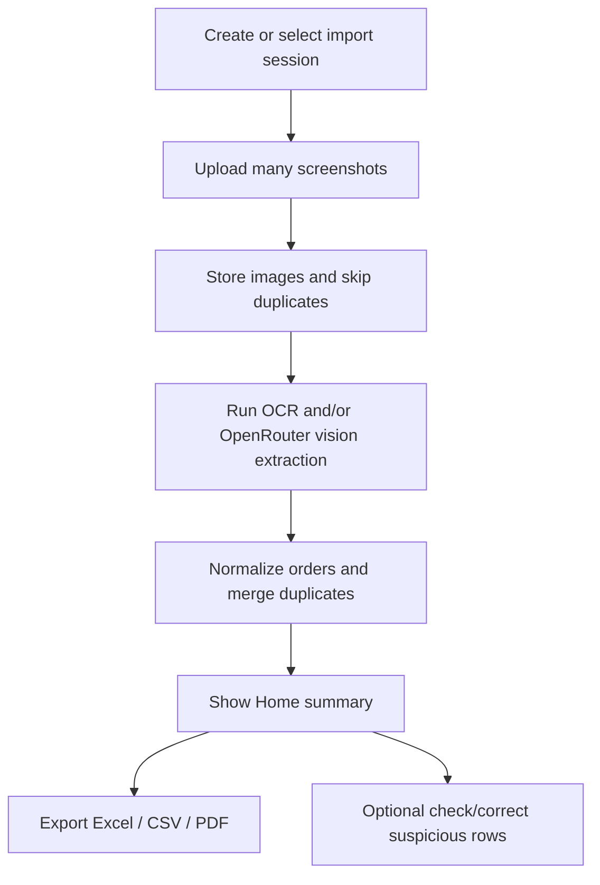

# OrderLedger Project Index

Fast map for AI agents and future handoff work.

## One-Sentence Product

OrderLedger reads monthly food delivery screenshots, extracts order rows, summarizes spending, and exports Excel / CSV / PDF.

## Current User Flow



Main point: upload should lead to automatic extraction and summary. Review/check is optional.

## Main Files

### Frontend

- `src/main.tsx` - React entrypoint.
- `src/App.tsx` - app shell, tab selection, sheets, top-level flow.
- `src/api.ts` - all frontend HTTP calls and frontend-facing API types.
- `src/state/AppData.tsx` - shared app state, active batch, summary, settings, upload/process actions.
- `src/styles.css` - app-level CSS imports and small page-specific layout.
- `src/design/tokens.css` - current design tokens.
- `src/design/components.css` - current component styles.

### Screens

- `src/screens/HomeScreen.tsx` - primary summary surface and upload entry.
- `src/screens/UploadFlow.tsx` - screenshot picker/upload/extraction progress sheet.
- `src/screens/BatchesScreen.tsx` - import history and active import selection.
- `src/screens/ExportScreen.tsx` - export actions and export warnings.
- `src/screens/ReviewScreen.tsx` - optional correction/debug surface. Not canonical navigation.

### Components

- `src/components/ui.tsx` - local icons and shared primitives: buttons, badges, alerts, tab bar, bottom sheet.
- `src/components/SettingsSheet.tsx` - OpenRouter/OCR settings and model picker.
- `src/components/CreateBatchSheet.tsx` - import creation.
- `src/components/OrderSheet.tsx` - optional order correction sheet.

### Backend

- `server/index.ts` - Express app and HTTP routes.
- `server/db.ts` - SQLite connection/schema setup.
- `server/store.ts` - persistence operations, settings, summaries, order updates.
- `server/types.ts` - backend domain types.
- `server/image-store.ts` - uploaded screenshot storage and image metadata.
- `server/normalize.ts` - source app guessing, extracted order normalization, duplicate keys, evidence mapping.
- `server/export.ts` - Excel, CSV, and PDF export builders.
- `server/json.ts` - JSON parsing helpers.

### Extraction

- `server/extraction/process.ts` - batch processing orchestrator.
- `server/extraction/openrouter.ts` - OpenRouter extraction path.
- `server/extraction/heuristics.ts` - fallback extraction path from OCR rows.
- `server/ocr/ocr-runner.ts` - PaddleOCR process runner and queue.
- `scripts/paddle_ocr_worker.py` - Python OCR worker.
- `scripts/setup-ocr.ps1` - Windows OCR environment setup.

## HTTP API

Base backend: `http://127.0.0.1:8788`

- `GET /api/health`
- `GET /api/settings`
- `PATCH /api/settings`
- `GET /api/settings/openrouter-models`
- `POST /api/batches`
- `GET /api/batches`
- `GET /api/batches/:id`
- `DELETE /api/batches/:id`
- `POST /api/batches/:id/screenshots`
- `POST /api/batches/:id/process`
- `GET /api/batches/:id/orders`
- `PATCH /api/orders/:id`
- `DELETE /api/orders/:id`
- `GET /api/screenshots/:id/image`
- `GET /api/batches/:id/export.xls`
- `GET /api/batches/:id/export.csv`
- `GET /api/batches/:id/export.pdf`

## Data Flow

1. `UploadFlow` calls `useAppData().uploadFiles(files)`.
2. `AppData` calls `endpoints.uploadScreenshots(activeBatchId, files)`.
3. `server/index.ts` stores images through `server/image-store.ts`.
4. Duplicate screenshots are skipped by content hash.
5. `UploadFlow` should trigger `processActiveBatch(false)` automatically after successful upload.
6. `server/extraction/process.ts` runs OCR, OpenRouter extraction if configured, or heuristic fallback.
7. `normalizeExtractedOrder` produces canonical order fields.
8. `upsertOrder` stores rows and merges duplicates by duplicate key.
9. `getBatchSummary` returns counts and spend totals.
10. Home displays the summary and Export creates files.

## Summary Fields

The Home/Export surfaces primarily use:

- `screenshotsTotal`
- `screenshotsProcessed`
- `screenshotsFailed`
- `ordersTotal`
- `ordersNeedingReview` - user-facing label should usually be "Needs check"
- `netSpend`
- `completedSpend`
- `refundedOrCancelled`

## Order Fields

Important frontend order fields:

- `source_app`
- `ordered_at`
- `restaurant_name`
- `total_amount`
- `status`
- `refund_amount`
- `net_amount`
- `items_text`
- `confidence`
- `review_state`
- `evidence_json`

## Extraction Priority

Accuracy priorities:

1. Correct total amount.
2. Correct order status: completed / cancelled / refunded / unknown.
3. Correct restaurant name and branch.
4. Correct order date/time.
5. Correct source app.
6. Items are useful but secondary for first release.

Cancelled/refunded orders must affect `net_amount` correctly.

## UI Copy Rules

Use:
- "Upload screenshots"
- "View summary"
- "Needs check"
- "May need checking"
- "Export"

Avoid as primary flow copy:
- "Review now"
- "Review queue"
- "You must review before export"

## Known Direction / Next Work

- Make upload-to-summary feel instant and automatic.
- Improve extraction confidence and duplicate merging.
- Add dashboard analytics later: spend by app, spend by restaurant, weekday/time patterns, monthly trends.
- Keep export available early.
- Keep correction tools available but not central.

## Verification

Run:

```bash
npm run build
```

Manual smoke:

1. `npm run dev`
2. open `http://127.0.0.1:5174`
3. create/select batch
4. upload screenshots
5. confirm extraction starts automatically
6. confirm Home summary updates
7. export `.xls`, `.csv`, `.pdf`
